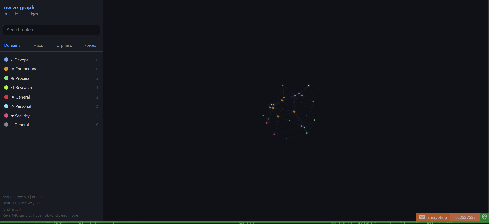

# nerve-graph

**A 5-channel 3D topology instrument for any folder of `[[wikilinked]]` markdown files.**

Turn your knowledge base into a living, breathing 3D map that shows you not just what's connected, but what's *structurally critical* and what's *actively being used*.

Works with **Obsidian**, **Logseq**, **Dendron**, **Foam**, **Zettlr**, or any folder of `.md` files that use `[[wikilinks]]`.

Zero subscription. Zero cloud. Runs on localhost from two files.



## What It Shows You

Five independent visual channels, each encoding different data — no two channels overlap:

| What You See | What It Means |
|---|---|
| **Node size** | Connection count (degree) |
| **Node pulse speed** | Bridge importance (betweenness centrality) |
| **Path brightness** | Recency — fresh paths glow, stale paths fade |
| **Particle density** (hover) | Mutual vs one-way link |
| **Particle colour** (hover) | Target domain |

**The key insight:** a small node that pulses is a *hidden bridge* — structurally critical despite being obscure. Remove it and two clusters lose their connection. You'd never spot these in a flat 2D graph.

## Quick Start

```bash
# 1. Install dependencies
pip install networkx pyyaml

# 2. Clone and configure
git clone https://github.com/ash23x/nerve-graph.git
cd nerve-graph

# 3. Edit config.json — point vault_path at your markdown folder
{
    "vault_path": "/path/to/your/vault",
    "vault_name": "MyVault"
}

# 4. Build the data
python build_vault_data.py

# 5. Open in browser
# Just open nerve_graph.html — no server needed
```

That's it. Three commands from clone to visualisation.

## Features

### Force Physics (Interactive)
- **Force sliders** — repulsion, link distance, link strength, centre gravity. Drag repulsion up and clusters physically separate. Drag it down and the core collapses. Find structural gaps in real time.
- **Cluster attractors** — each domain drifts toward its own region of 3D space via Fibonacci-sphere distribution. Your vault self-organises by topic.
- **Cluster shells** — wireframe bounding spheres around each domain. Toggle on after attractors settle to see compartment boundaries.
- **Synthetic inertia** — high-degree nodes feel heavy and resist movement. Orphans are nimble dust. The physics *feels* real.
- **Collision detection** — nodes push apart instead of clipping through each other.

### Visual Instrument
- **Betweenness pulse** — bridge nodes breathe. Fast pulse = structurally critical. Dead dark = cul-de-sac. Fifth-root transfer function with configurable gain.
- **Neural pruning** — path recency baked into the ambient view. Fresh connections glow. Stale connections fade to near-invisible. Your attention trails are visible without toggling anything.
- **Bloom halos** — radial glow sprites on bridge nodes, pulsing with betweenness. Visible at distance.
- **Curved bidirectional links** — mutual references arc, one-way links stay straight. You see conversations vs monologues.
- **Directional arrows** — one-way links show direction via arrowheads.
- **Antialiased rendering** — smooth edges via renderer config.

### Navigation
- **Ego mode** — double-click any node to isolate its 1st+2nd degree neighbourhood. Everything else fades to 6% opacity. Double-click again to exit. Essential for reading local structure in large graphs.
- **Keyboard shortcuts** — keys 1-9 jump the camera to the top 9 hubs instantly.
- **DAG layout toggle** — cycle through force-directed, top-down, bottom-up, left-right, right-left, and radial layouts. One button, six views.
- **Recency heatmap** — toggle domain colours to a red-blue temperature gradient. Red = modified today. Blue = untouched for weeks.
- **Screenshot export** — one-click PNG capture of the current view.
- **Sidebar hover** — hovering over hub/orphan/search items triggers the same 3D highlight + particle burst as hovering the actual node.

## Configuration

Edit `config.json`:

```json
{
    "vault_path": "/path/to/your/vault",
    "vault_name": "MyVault",
    "output": "vault_data.js",
    "skip_dirs": [".obsidian", ".git", "node_modules", ".trash", ".logseq"],
    "root_exponent": 0.2,
    "boost": 0.3,
    "custom_domains": {
        "physics": {"color": "#d500f9", "shape": "torusknot"},
        "health": {"color": "#76ff03", "shape": "octahedron"}
    }
}
```

| Field | What it does |
|---|---|
| `vault_path` | Path to your markdown folder (or `.` if nerve-graph is inside it) |
| `vault_name` | Display name in the header |
| `root_exponent` | Transfer function for betweenness (0.2 = fifth root, 0.25 = fourth root) |
| `boost` | Additive floor for pulse visibility (0.0–0.5) |
| `custom_domains` | Override auto-assigned colours/shapes for specific clusters |

Clusters are auto-discovered from YAML frontmatter (`cluster:` or first tag). If your notes don't have frontmatter, everything gets auto-assigned.

## How It Works

The build script (`build_vault_data.py`) scans your vault in two passes:

1. **Pass 1:** Discovers all `.md` files, extracts frontmatter (cluster, tags), records modification times
2. **Pass 2:** Extracts all `[[wikilinks]]` and builds a directed graph using NetworkX

It then computes:
- **Degree** — raw connection count per node
- **Betweenness centrality** — structural bridge importance (how many shortest paths route through each node)
- **Recency** — normalised modification time (0 = oldest, 1 = most recent)
- **Edge recency** — min of both endpoint recencies (a path is only as alive as its stalest end)
- **Bidirectionality** — whether A→B and B→A both exist

The HTML visualiser loads the generated `vault_data.js` and renders it using [3d-force-graph](https://github.com/vasturiano/3d-force-graph) (Three.js + d3-force-3d).

## Node Shapes by Domain

Domains are auto-discovered from frontmatter and assigned geometric shapes:

`icosahedron` · `cube` · `dodecahedron` · `octahedron` · `torus` · `tetrahedron` · `torusknot` · `cone`

Override via `custom_domains` in config.json.

## Requirements

- **Python 3.7+** with `networkx` and `pyyaml`
- A modern browser (Chrome, Firefox, Edge)
- A folder of `.md` files with `[[wikilinks]]`

No server needed. No database. No cloud. Open the HTML file directly.

## CLI Override

```bash
# Use config.json vault_path
python build_vault_data.py

# Override vault path from command line
python build_vault_data.py /path/to/other/vault
```

## Credits

Built by [Dr Gregory Ashley](https://github.com/ash23x) at Ontos Labs.

Graph engine: [3d-force-graph](https://github.com/vasturiano/3d-force-graph) by Vasco Asturiano.
Topology: [NetworkX](https://networkx.org/).

## License

MIT — do whatever you want with it.
